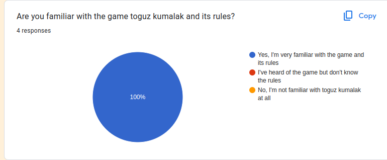
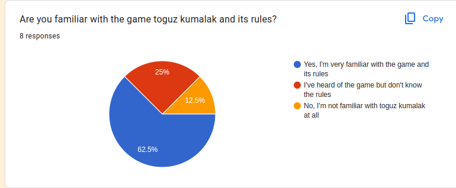

# Report

Alpha Test Results:

.png)
.png)
.png)
.png)

Beta Test Results:

.png)
.png)
.png)
.png)
.png)
.png)

Post-Testing Survey Summary:
Game Experience: Most users found the game engaging and enjoyed the unique cultural touch. There was a consensus on the need for a tutorial or guided walkthrough. One of the participants, familiar with the game Togyz Korgool, said that there is no adaptation of the game on the Internet where you can play with bots, and that she really likes our idea of playing with a bot trainer who teaches how to play

Cultural Representation: Participants familiar with Toguz Korgool appreciated the authentic representation, while new users found it a delightful introduction to the game.

Potential Improvements: A common suggestion was the introduction of tutorials, guided gameplay, and in-game hints. Some also expressed interest in multiplayer options and global leaderboards.

Willingness to Use Regularly: 7 out of 8 participants expressed an interest in playing the game regularly, especially if some of the suggested features were introduced.
